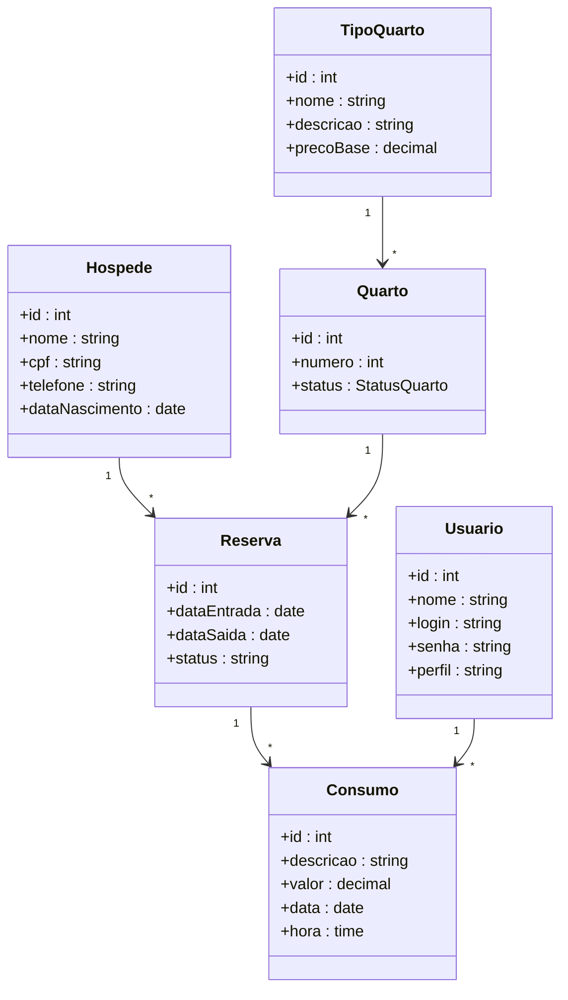
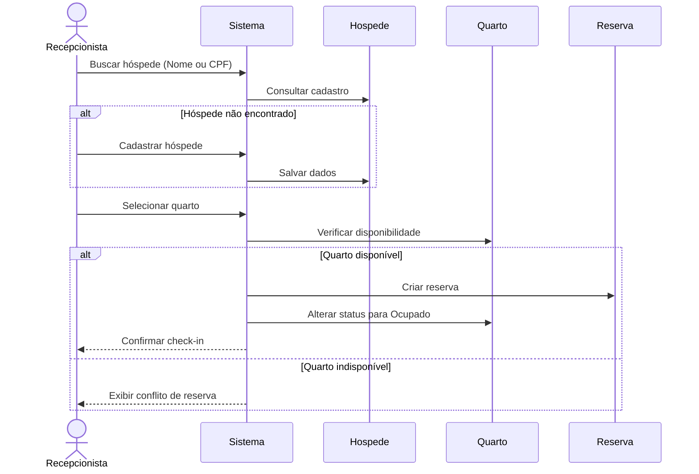
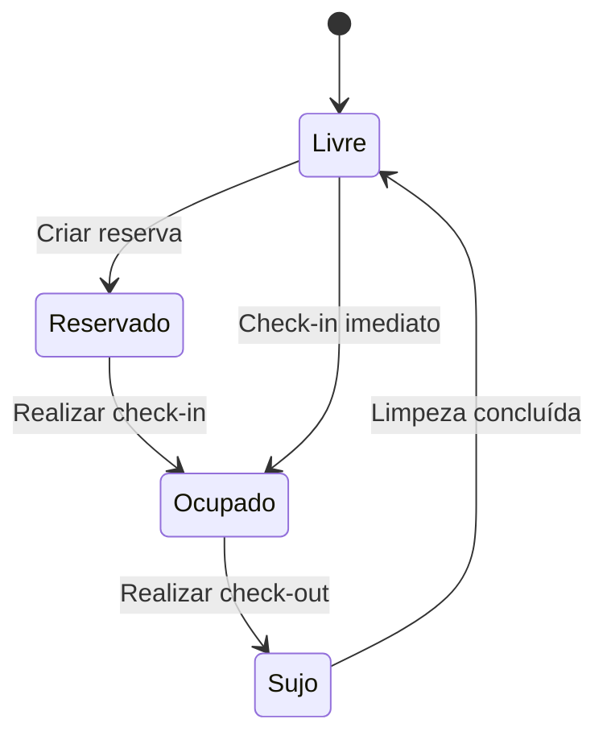

# Platform Independent Model (PIM)

## Sistema de Gestão Hoteleira Bela Vista

---

## Introdução

Após a validação dos requisitos junto ao cliente Sr. Geraldo, foi desenvolvido o Platform Independent Model (PIM) do Sistema de Gestão Hoteleira Bela Vista.

O PIM representa a estrutura lógica do sistema de forma independente de linguagem de programação, banco de dados ou plataforma tecnológica, permitindo visualizar os principais componentes e comportamentos do software antes de sua implementação.

---

## Objetivo

Modelar a estrutura e o comportamento do Sistema de Gestão Hoteleira Bela Vista utilizando diagramas UML, permitindo compreender seu funcionamento de forma independente de tecnologia.

---

## Requisitos contemplados

Os diagramas desenvolvidos representam os principais requisitos funcionais do sistema:

- Cadastro e busca de hóspedes;
- Controle de reservas;
- Gerenciamento de quartos;
- Check-in e Check-out;
- Registro de consumos;
- Controle de limpeza;
- Controle do status dos quartos.

---

# Diagrama de Classes

O diagrama de classes apresenta as principais entidades do sistema e seus relacionamentos.

### Explicação

Este diagrama representa a estrutura estática do sistema. As classes modelam as principais entidades do domínio, enquanto os relacionamentos mostram como essas entidades interagem.

---

# Diagrama de Sequência

O diagrama abaixo representa o fluxo do processo de **Check-in**.

### Explicação

O diagrama demonstra a interação entre recepcionista, sistema, hóspede, quarto e reserva durante a realização do check-in.

---

# Diagrama de Estados

O diagrama representa o ciclo de vida de um quarto.

### Explicação

O quarto inicia no estado **Livre**, pode ser reservado, ocupado durante a hospedagem, tornar-se **Sujo** após o check-out e retornar ao estado **Livre** após a limpeza.

---

# Conclusão

O Platform Independent Model desenvolvido representa a estrutura lógica do Sistema de Gestão Hoteleira Bela Vista de forma independente de tecnologia.

Os diagramas produzidos permitem compreender a estrutura do sistema, as interações entre seus componentes e o comportamento dos quartos durante todo o processo de hospedagem, servindo como base para a implementação futura.
