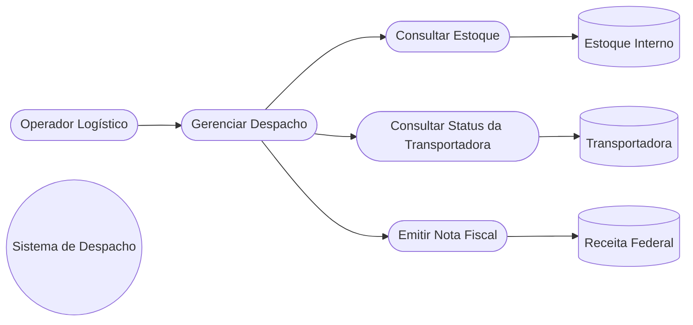
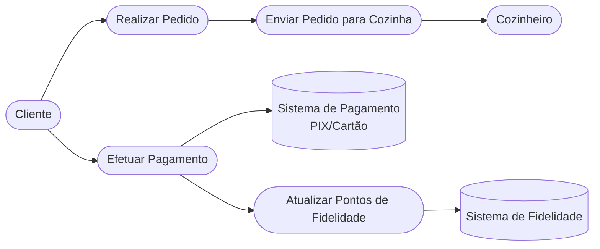
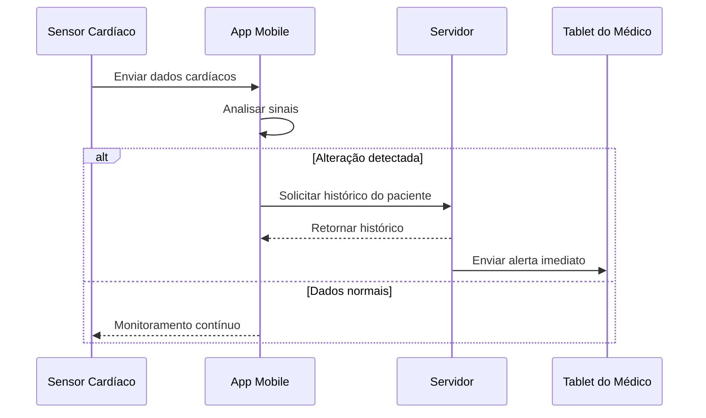
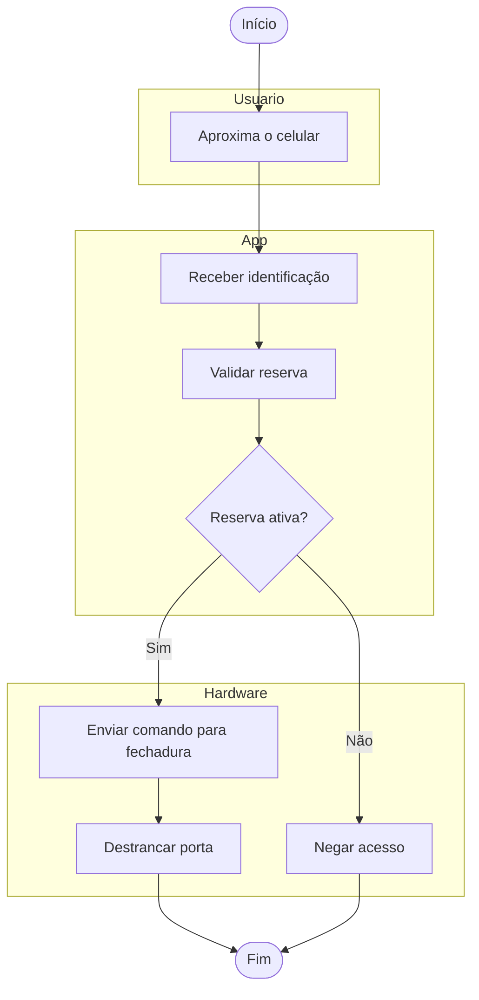
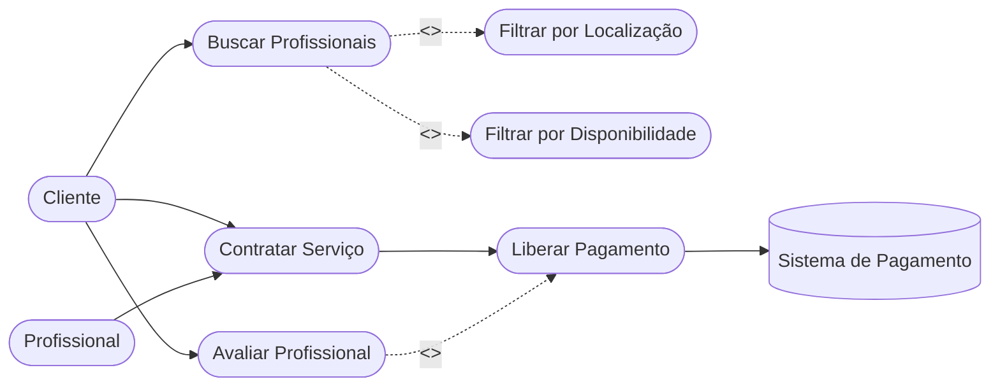

# Exercícios de Revisão - Semana 10

## Introdução

Esta atividade tem como objetivo revisar os principais diagramas UML estudados durante a disciplina, aplicando-os em diferentes cenários propostos pelo professor.

Cada cenário foi modelado utilizando o tipo de diagrama mais adequado, considerando o comportamento esperado do sistema e as interações entre seus atores.

---

# Cenário 1 – Logística de E-commerce Global

## Diagrama de Casos de Uso

O sistema é responsável pelo gerenciamento do despacho de mercadorias. Para realizar essa atividade, consulta o estoque interno, verifica o status da transportadora e envia os dados necessários para a Receita Federal emitir a nota fiscal.

### Explicação

O diagrama evidencia a fronteira do sistema e mostra as integrações com sistemas externos, como Estoque, Transportadora e Receita Federal.
---

# Cenário 2 – Totem de Autoatendimento em Fast-Food

## Diagrama de Casos de Uso

Neste cenário, o cliente realiza seu pedido diretamente no totem e efetua o pagamento via cartão ou PIX. Após a confirmação do pagamento, o pedido é enviado para a cozinha e os pontos de fidelidade do cliente são atualizados.

### Explicação

O diagrama apresenta os principais atores envolvidos no processo de autoatendimento: o Cliente, que realiza o pedido e o pagamento; o Cozinheiro, que recebe o pedido para preparo; o Sistema de Pagamento, responsável pela autorização da transação; e o Sistema de Fidelidade, que registra a pontuação do cliente após a compra.

---

# Cenário 3 – Sistema de Telemedicina (Monitoramento)

## Diagrama de Sequência

Neste cenário, um sensor cardíaco envia continuamente dados ao aplicativo móvel. Caso seja detectada alguma alteração, o aplicativo solicita ao servidor o histórico do paciente. Em seguida, o servidor envia um alerta imediato ao tablet do médico responsável.

### Explicação

O diagrama de sequência representa a ordem cronológica das mensagens trocadas entre os componentes do sistema. Ele evidencia que o sensor envia dados ao aplicativo, que realiza a análise inicial. Havendo uma alteração, o servidor é consultado para recuperar o histórico do paciente e, em seguida, envia um alerta ao médico para que possa tomar as providências necessárias.

---

# Cenário 4 – Sistema de Controle de Acesso Inteligente

## Diagrama de Atividades

Neste cenário, o usuário aproxima o celular da porta. O aplicativo valida se existe uma reserva ativa para a sala de reuniões. Caso a reserva seja válida, um comando é enviado à fechadura eletrônica para liberar o acesso; caso contrário, o acesso é negado.

### Explicação

O diagrama de atividades representa o fluxo de execução do processo de acesso à sala de reuniões. O usuário inicia a interação aproximando o celular, o aplicativo valida a existência de uma reserva ativa e, dependendo do resultado, o hardware libera ou bloqueia a abertura da porta.

---

# Cenário 5 – Marketplace de Serviços Domésticos

## Diagrama de Casos de Uso

Neste cenário, o cliente busca profissionais disponíveis para realizar um serviço doméstico. Durante a busca, o sistema obrigatoriamente filtra os profissionais por localização e disponibilidade. Após a execução do serviço, o pagamento é liberado e o cliente pode avaliar o profissional.

### Explicação

O caso de uso **Buscar Profissionais** possui duas relações `<<include>>`, pois a busca sempre exige os filtros de localização e disponibilidade. Já o caso de uso **Avaliar Profissional** utiliza `<<extend>>`, pois a avaliação é uma funcionalidade opcional após a conclusão do serviço e a liberação do pagamento.

---

# Conclusão

A realização desta atividade permitiu aplicar diferentes tipos de diagramas UML em cenários variados, reforçando a compreensão sobre quando utilizar cada modelo de acordo com o objetivo da modelagem.

Os Diagramas de Casos de Uso possibilitaram identificar os atores envolvidos e as funcionalidades oferecidas pelo sistema, evidenciando também as interações com entidades externas. O Diagrama de Sequência demonstrou a ordem cronológica das mensagens trocadas entre os componentes de um sistema, enquanto o Diagrama de Atividades representou o fluxo de execução de um processo e suas decisões.

Dessa forma, os exercícios contribuíram para consolidar os conceitos de modelagem de contexto e interação, auxiliando no desenvolvimento da capacidade de analisar sistemas sob diferentes perspectivas e selecionar o diagrama mais adequado para cada situação.
